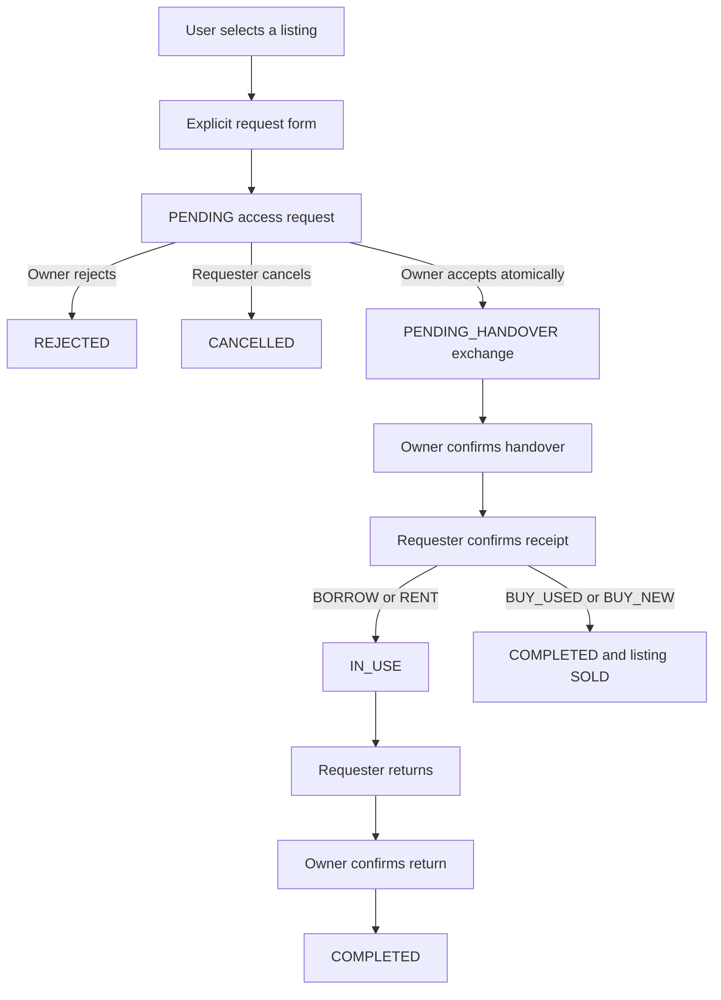

# Resource Listing Architecture

Phase 17 connects user-generated items and offers to Supabase PostgreSQL while preserving the existing `AccessOption` contract and deterministic decision engine.

## Item vs Listing

An `Item` is the physical resource: name, description, category, brand/model, images, condition, specifications, and owner. A `Listing` is a separate offer for that item: access type, title/description, price and unit, deposit, availability, approximate location, and lifecycle status. A single item can support separate offers without duplicating its physical details.

## Ownership and RLS

Protected Express routes verify the Supabase bearer token in `attachUser`. They pass that same token to a request-scoped anon-key client, so PostgreSQL evaluates `auth.uid()` and the existing RLS policies. The service derives `owner_id` from the verified request identity and ignores owner IDs in request bodies. Item insert/update policies require the owner; listing insert/update policies require the authenticated listing and item owner. Public reads are limited to ACTIVE listings. Owners can read and update their own non-public statuses. No service-role key is used by listing routes.

Public profile joins are limited to rows with an ACTIVE listing and use existing anon column grants; email, phone, bio, and verification fields are not selected or granted to anon. Exact geography is write-only through normal table access. The nearby RPC runs as SECURITY DEFINER with a fixed empty search path and validated parameters because callers cannot select geography; it returns computed distance, never coordinates.

## Lifecycle

Supabase values are `ACTIVE`, `PAUSED`, `UNAVAILABLE`, `SOLD`, and `ARCHIVED`. The UI supports publish, pause/reactivate, and archive. Archive updates status instead of deleting a referenced row. `available_from`/`available_until` and availability (`AVAILABLE`, `PARTIALLY_AVAILABLE`, `UNAVAILABLE`) remain separate from listing lifecycle status.

## API and service

- `POST /api/listings`: create an `items` row, then a separate `listings` row; the owner comes from the verified session.
- `GET /api/listings`: active public listings with bounded retrieval, database category/access/condition/availability/location/search filters, and sorting.
- `GET /api/listings/:id`: public ACTIVE detail; an authenticated owner may also read their own paused/archived detail.
- `GET /api/users/me/listings`: RLS-scoped owner management list.
- `PATCH /api/listings/:id`: owner-only item/listing edits and pause/reactivation.
- `DELETE /api/listings/:id`: owner-only archive operation; no permanent delete.

`server/services/supabaseListingService.ts` owns Supabase row mapping and CRUD. The existing listing service preserves explicit mock and Mongo modes. In the default mode, configured Supabase URL plus anon key selects Supabase; `DATABASE_MODE=mock` and `DATABASE_MODE=mongo` remain explicit development/legacy overrides.

## Decision and location flow

Supabase rows map through `listingToAccessOption` into the existing normalized resource contract. The AI route retrieves only Supabase candidates in Supabase mode; static `mockAccessOptions` are not concatenated with live data. Requirement extraction and explanations remain with Gemini; retrieval, distance, scoring, ownership analysis, and recommendations remain deterministic and unchanged.

Nearby candidate retrieval uses `nearby_listings` and maps its `distance_meters` to kilometers. Public display uses `location_area`; private coordinates are never returned. Listings without coordinates remain eligible for normal browse and decision retrieval.

## Images and remaining demo data

The create form accepts up to six HTTP(S) image URLs. The existing private `listing-images` bucket is not wired to an upload flow; no image upload or signed-URL management is claimed. Static catalog data remains in unit tests, explicit mock mode, and legacy unused prototype modules, but is not used by the active Browse, Dashboard, My Listings, or Supabase decision paths.

## Access request and exchange lifecycle

The existing `public.access_requests` and `public.exchanges` tables are used; no duplicate lifecycle tables are created. A request records a listing snapshot reference, requester (from `auth.uid()`), owner (looked up from the listing), access type, requested period, optional message, listed price/deposit, and state. The client cannot choose requester, owner, price, or access type.

Request states are `PENDING`, `ACCEPTED`, `REJECTED`, `CANCELLED`, and `COMPLETED`. Only `PENDING` can become `ACCEPTED`, `REJECTED`, or `CANCELLED`; only `ACCEPTED` can become `COMPLETED`. Database triggers enforce these transitions. A partial unique index prevents more than one pending request per requester/listing while preserving historical rows.

Exchange states are `PENDING_HANDOVER`, `HANDED_OVER`, `IN_USE`, `RETURN_PENDING`, `RETURNED`, `COMPLETED`, and `CANCELLED`. `decide_access_request` locks the request and listing, validates the owner and pending status, rechecks availability, inserts the exchange, and accepts the request atomically. Accepted BORROW/RENT periods are checked as half-open `tstzrange` intervals under a listing row lock; non-overlapping periods remain acceptable. The database trigger repeats the acceptance checks.

`advance_exchange` permits only participant-specific transitions: owner confirms handover; requester confirms receipt; only BORROW/RENT can request and confirm return. BUY_USED/BUY_NEW complete at receipt and mark the listing `SOLD`. No price is collected, no payment is processed, and no request automatically follows a recommendation. The requester explicitly confirms the request form.

All request/exchange reads and writes go through verified-token API routes and narrowly granted RPC functions. Direct client INSERT/UPDATE grants are revoked. RPCs derive identity from `auth.uid()`, validate role/state, use a fixed empty search path, and are executable only by `authenticated`. Participant detail reads expose safe names and `location_area`, never private coordinates, phone, or email.

Payment gateways, messaging/chat, and notification delivery are out of scope. No authenticated transaction mutations have been exercised against a signed-in production user; the connected project currently has no request or exchange rows.
